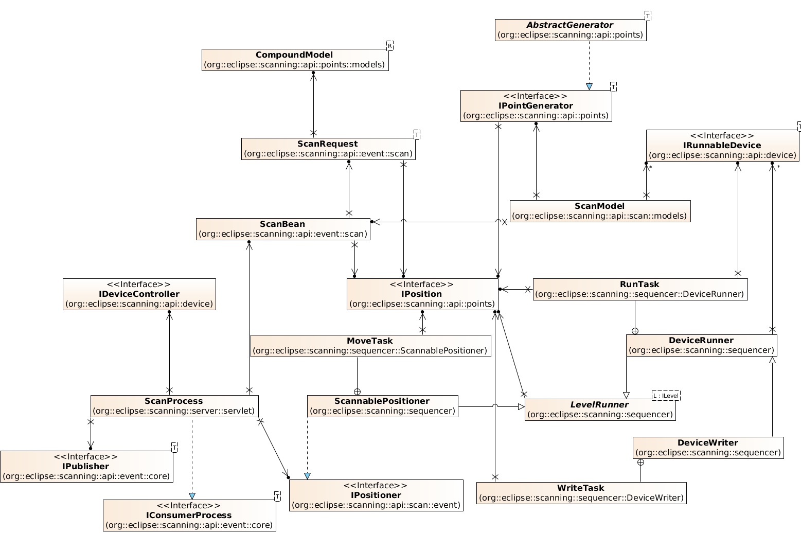
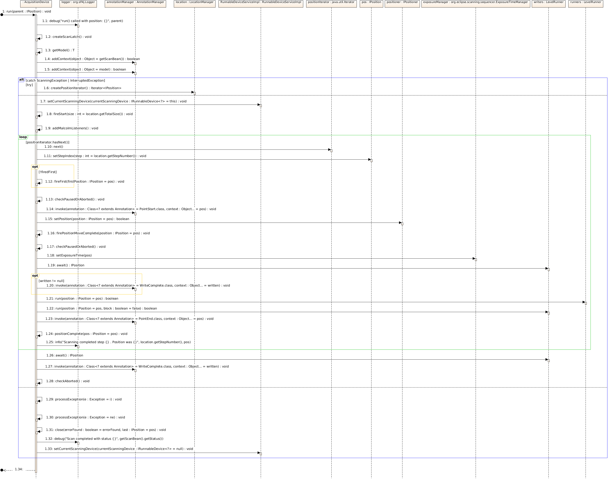
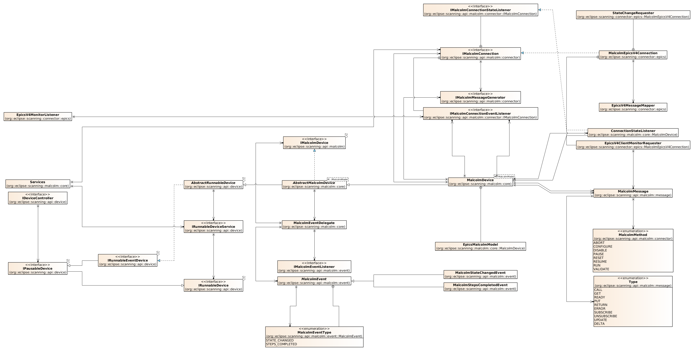

# [Eclipse Scanning](http://eclipse.github.io/scanning)

Scanning is an open source project for moving scientific instruments and writing [NeXus](http://www.nexusformat.org/) compliant files. It is designed to be control system neutral, EPICS, TANGO etc. may be used. See [proposal](https://projects.eclipse.org/proposals/scanning) and [Getting Started](https://github.com/eclipse/scanning/blob/master/GETTINGSTARTED.pdf)

# Adding Tests
The test system is linked into Travis CI and your pull request will be checked with the build and test. Tests should not be added in the same bundle that created the feature but in a .test bundle which may be a fragment of the original bundle. This enables the build to remove test code from the binary easily because those bundles are not in the feature. NOTE This has the added benefit that your test bunles or fragment may have dependencies which the main bundle does not. For instance in org.eclipse.scanning.test we depend on almost eveything imaginable but of course this bundle is not part of the binary product.

Instead of having to name your class *Test as in other projects, in this project you should add a Suite to each package of tests. This defines the tests that are run automatically in the build. This procedure allows for long running or CPU/threading tests to be ommited from a build to keep the run time down while waiting for the merge.

Example: [org.eclipse.scanning.test.points.Suite](https://github.com/eclipse/scanning/blob/master/org.eclipse.scanning.test/src/org/eclipse/scanning/test/points/Suite.java)

# Check out a development version
1. Clone repositories as specified in .travis.yml at the top of this repository (richbeans, dawnsci, dawn-hdf)
2. Clone this repositiory to org.eclipse.scanning
3. Import all the bundles from all the repos to your eclipse workspace (other IDE's are available but they probably don't support target platforms)
4. Use the org.eclipse.scanning.target.platform target plaform which will pull in a few apacahe dependencies
5. After setting this target as the target platform, your code should compile
6. Start an apachemq on localhost:61616
7. Run the example server and example client and go to the 'X-Ray Centering' example erspective or the 'Scanning' perspective.

# Where is Scanning Used
Currently the scanning project is used as part of [Generic Data Acquisition](http://www.opengda.org/) for certain scan types, those linked to NeXus writing, layered scans and mapping including [Malcolm Devices](https://alfred.diamond.ac.uk/documentation/manuals/GDA_Developer_Guide/master/malcolm.html#use-of-malcolm-in-new-style-scanning). You can read more about how the scanning project is used at
 Mapping and (Solstice Scanning)[https://alfred.diamond.ac.uk/documentation/manuals/GDA_Developer_Guide/master/use_cases.html#use-case-new-style-solstice]. [Diamond Light Source Ltd.](http://diamond.ac.uk/) produce their own Java API for the scanning library [javadocs here](https://alfred.diamond.ac.uk/documentation/javadocs/GDA/master/org/eclipse/scanning/api/package-summary.html) .

* Class Diagram of core scanning components:

* Sequence Diagram

* Class Diagram Malcolm

